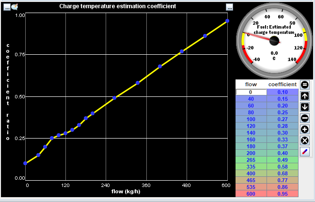

# Charge Temperature Estimation

Charge temperature estimation is used to model the increase in intake air temperature after the IAT sensor by the heat of the intake piping, intake manifold, cylinder head, etc. Without accurate charge temperature estimation it is possible that an engine may exhibit leaner air fuel ratios at higher IATs, especially under low load like idle and light cruise. This is common when the VE table is tuned at lower IATs without charge temperature estimation.

## Mode

Three modes of charge temperature estimation are available; _RPM+TPS_, _Air Mass Interpolation_ and _Table_.

### RPM+TPS (Default)

Interpolates between four coefficients based on RPM and TPS to generate a coefficient for estimating the intake air temperature. The coefficient determines the percentage of the estimated air temperature that comes from the IAT with the remainder coming from the CLT.

For example, a coefficient of 0.2500 means that 25% of the estimated air temperature is from the IAT, and 75% from the CLT. If the IAT was 40C and the CLT was 80C, the calculation for estimated air temperature would be `(40C * 0.25) + (80C * 0.75) = 70C`.

A coefficient of 0.9000 (which may be used at high loads/RPM) would result in the calculation `(40C * 0.90) + (80C * 0.10) = 44C`. A coefficient of 1 means that the charge temperature estimate would be the same as IAT.

### Air Mass Interpolation

Also labeled as Airflow interpolation mode. This uses linear interpolation between the _low flow coefficient_ at zero flow and the _high flow coefficient_ at the _max air flow_ to calculate the balance between IAT and CLT to arrive at the final estimated air temperature. Similar to RPM+TPS, the calculated coefficient determines what percentage of the IAT makes up the charge temperature estimate.

For example, a _low flow coefficient_ of 0.100, a _high flow coefficent_ of 0.900 and a _max air flow_ of 300 kg/h would result in a calculated coefficient of 0.5 at an air flow of 150 kg/h. This means that the charge temperature estimate would be a 50/50 split between IAT and CLT. At or above _max air flow_, the calculated coefficient would be 0.9. Similar to the above examples in RPM+TPS mode (40C IAT and 80C CLT), the resultant charge temperature estimate would be `(40C * 0.90) + (80C * 0.10) = 44C` at or above _max air flow_.

### Table

Uses a 2D table to return the charge temperature estimation coefficient based on the calculated flow rate. Similar to the above examples, the resultant charge temperature estimate is calculated by `(IAT * coefficient) + (CLT * [1 - coefficient])`.

## Increase rate limit, Decrease rate limit

These settings control how quickly the charge temperature estimate value can increase or decrease to the new calculated value. The unit is degrees Celsius/second (degC/sec). Refer to the output _Air: Charge temperature estimate_. Note that there are two outputs with this name, one in degC and the other in degK.

For example, if the current charge temperature estimate value is `40C` and the modeled charge temperature should be `50C`, an _increase rate limit_ of 1 deg/sec means that it would take 10 seconds for the charge temperature estimate value to increase from `40C` to `50C`.

Conversely, if the current charge temperature estimate is `50C` and the modeled charge temperature changed back to `40C`, a _decrease rate limit_ of 5 deg/sec means that it would take 2 seconds for the charge temperature estimate value to decrease from `50C` to `40C`.
